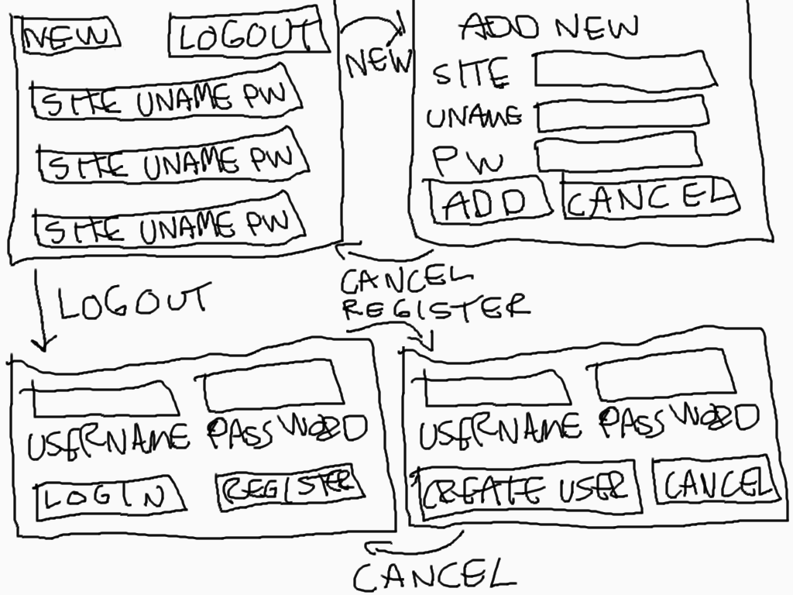

# Vaatimusmäärittely

## Sovelluksen tarkoitus

Sovellus on yksinkertainen salasanojen hallinnointipalvelu. Uusi käyttäjä voi luoda käyttäjätunnuksen, jonka jälkeen kirjautuneena käyttäjä voi lisätä sekä poistaa haluamiansa tunnuksia eri palveluihin.

## Käyttöliittymäluonnos

Sovellus koostuu neljästä eri näkymästä. Sovellus aukeaa kirjautumisnäkymään josta käyttäjä voi joko siirtyä uuden käyttäjän lisäysnäkymään tai kirjautumalla sovelluksen päänäkymään. Päänäkymässä käyttäjä voi siirtyä uuden salasanan lisäysnäkymään tai uloskirjautumalla kirjautumisnäkymään. Lisäysnäkymistä päästään edelliseen näkymään cancel-napin avulla. 

## Lopullisen tarjoama toiminnallisuus

#### Ennen kirjautumista
- :heavy_check_mark: Käyttäjä voi kirjautua sovellukseen
  - :heavy_check_mark: käyttäjä syöttää käyttäjätunnuksen sekä salasanan lomakkeeseen
  - :heavy_check_mark: käyttäjätunnuksen sekä salasanan täsmätessä käyttäjä kirjataan sovellukseen sisään
  - :heavy_check_mark: kirjautuminen epäonnistuu jos käyttäjätunnus sekä salasana eivät täsmää
  - :heavy_check_mark: järjestelmään voi luoda uuden käyttäjän
  - :heavy_check_mark: uuden käyttäjän luominen epäonnistuu, jos jompikumpi kentistä on tyhjä
  - :heavy_check_mark: uuden käyttäjän luominen epäonnistuu, jos käyttäjänimi on yli 30 merkkiä tai salasana yli 50 merkkiä pitkä
  - :heavy_check_mark: uuden käyttäjän lisäyssivulta pääsee kirjautumisnäkymään cancel-napilla

#### Kirjautumisen jälkeen

  - :heavy_check_mark: käyttäjä siirtyy näkymään jossa näytetään käyttäjän lisäämät salasanat
  - :heavy_check_mark: käyttäjä siirtyy uuden lisäyksen mahdollistamaan näkymään
  - :heavy_check_mark: käyttäjä voi lisätä uusia salasanoja järjestelmään
  - :heavy_check_mark: salasanan lisäys epäonnistuu, jos jokin kentistä on tyhjä
  - :heavy_check_mark: käyttäjä voi kirjautua järjestelmästä ulos painamalla 'Logout'-nappia

## Jatkokehitysideoita

- Salasanojen poisto sovelluksesta käyttöliittymän kautta
- Käyttäjätunnusten hashaus
- Lisättyjen salasanojen listaus eri kriteerien mukaan
- Salasanojen filtteröinti päänäkymässä
